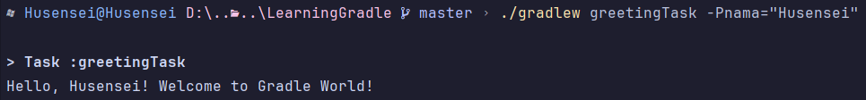

# Greetings in Gradle

This project demonstrates a simple Gradle task that personalizes greetings using a command-line argument.

**Prerequisites**

* Java 11 or later
    
**Usage**

1. Clone this repository using Git.
2. Navigate to the project directory in your terminal.
2. Run the task with the `nama` parameter followed by your desired name enclosed in double quotes, using the Gradle Wrapper script:

  ```java
  ./gradlew greetingTask -Pnama="Your Name"
```

This will output a greeting message like:

  ```
  Hello, Your Name! Welcome to Gradle World!
```

**Example**


